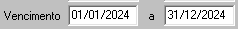
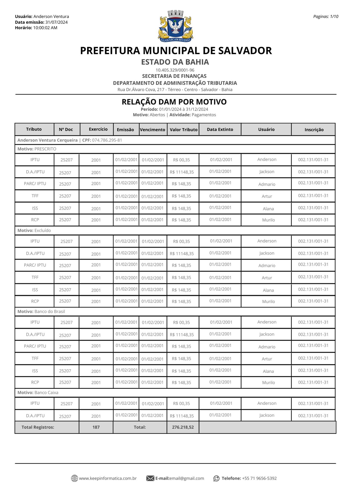

### Relação DAM por Motivo: 

#### Filtros

1.  **Período:** 
    >**Observação:** (Data - *type: Date* -Data da emissão do DAM'S) <br>
    

2.  **Vencimento:**
    >**Observação:** (Data - *Type: Date* - Data de vencimento original dos DAM's)<br>
    

3.  **Tributo:** 
    >**Observação:** <br>   *Multiplo* _select_ -- classificação de receita (tipo do tributo *IPTU, TFF, ...)*<br>
    <br>
    

4.  **D.A.:** 
    > **Observação:** *Checkbox* Caso seja uma D.A. deve-se colocar apenas D.A. do tipo do tributo marcado acima em **Tributos**<br>
    

5.  **Exercicio:** 
    > **Observação:** Seleciona *Ano (2024, 2023, 2022, ...)* <br>
    Filtro da competencia<br>
    <br>
    

6.  **Motivo:**
    >   **Observação:** Multiplo _Select_, podendo selecionar varios **motivos:** Excluido, pré-inscrito, cancelado, impugnado, extinção, migração, suspenso e compensado.    

7.  **Atividade Principal:** 
    >**Observação:** _Multipla opções_, podendo selecionar varios CNAES_PRINCIPAL. <br>

####   Layout PDF:
**Campos:** 
 ```
 1. Tributos            -  
 2. Contribuinte        -   Contribuinte + CPF/CNPJ 
 3. Motivo 
 4. N Doc               -   Numero documento          
 5. Exercicio           -   Exercico da Cota
 6. Vencimento          -   Vencimento original da Cota
 7. Valor Tributo       -   Valor original da cota
 8. Data Extinto        -   Valor extinção da Cota;
 9.  Usuário            -   Usuario que efetuo a exitinção da cota;
 10. Inscrição          -   Inscrição;
 11. Total Registros    -   Quantidade de Cotas e total valor original (Valor Tributo); 
 12. Total Registros    -   Total de registros, Valor total do valor tributos do relatorio; 
```
