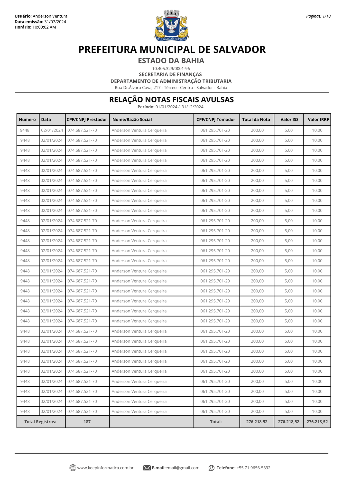

### ✅Relação de Notas Fiscais Avulsas:

####    Filtros:

1.  **Período:** 
    >**Observação:** (Data - *type: Date* -Data da emissão do DAM'S) <br>
    

2.  **Prestador:**
    >   **Observação:** Filtro de pesquisa dos prestadores de serviço, trazendo as informações apenas do prestador desejado com filtro.
    

3.  **Tomador:** 
    >   **Observação:**     Fiiltro de pesquisa dos tomadores de serviço, trazendo as informações apenas do tomador desejado com filtro. 
    

4. **Ordenar:**
    >   **Observação:** Select para ordenar por (Data emissão da Nota Fiscal Avulsa, numero da Nota Fiscal ou prestador alfabetica [A-Z]), apenas uma escolha de organização, 'orde by'.


####   Layout PDF:
**Campos:** 
 ```
1.  Numero               - Numero das Notas Avulsas;
2.  Data                 - Data emissão das Notas Avulsas;
3.  CPF/CNPJ Prestador   - CPF/CNPJ do Prestador da Nota;
4.  Nome/Razão Social    - Nome contribuinte do Prestador;
5.  CPF/CNPJ Tomador     - CPF/CNPJ do Tomador da Nota;
6.  Total da Nota        - Valor da Nota;
7.  Valor ISS            - Valor recolhimento do ISS da Nota; 
8.  Valor IRRF           - Valor recolhimento do IRRF da Nota 
9.  Total Registros:     - Quantidade totald e Notas, total valor das Notas, total valor dos ISS das notas
                            e valor total IRRF das Notas;  
```
