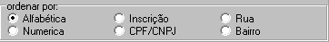

### ✅ - Listagem de Contribuinte:

#### Filtros:

1.  **Tributo:** 
    >**Observação:** <br>   *Multiplo* _select_ -- classificação de receita (tipo do tributo *IPTU, TFF, ..*<br>
    **Exemplo campo do sistema Antigo:** <br>
    <br>
    

2.   **Atividade Principal:**
    >**Observação:** _Multipla opções_, podendo selecionar varios CNAES_PRINCIPAL. <br>

3.  **Inscrição:**
    >   **Observação:** *(Do lançamento do DAM)*, possibilidade de colocar apenas uma inscrição.
    <br> 
    **Exemplo campo do sistema Antigo:**  <br> 
     

4.  **Tipo Pessoa:** 
    >   **Observação:** _Select_ Todoas, juridica ou fisica; <br>
    **Exemplo campo do sistema Antigo:** <br>
    <br>
    


5. **Porte:** 
    > **Observação:** Mutipla seleção porte da Empresa: <br>
    **Exemplo campo do sistema Antigo:** <br>
    <br>
    

6.  **Situação:**
    > **Observação:** _Select_ (situação/Status) contribuinte.<br>
    **Exemplo campo do sistema Antigo:** <br>
    <br>
    

7.  **Periodo Atividade:** 
    >   **Observação:** Filtro tipo _Data_, _Inicio da atividade principal_ dos contribuintes. <br>
    **Exemplo campo do sistema Antigo:** 
    <br>
    

8.  **Período Cadastro contribuinte:** 
    >   **Observação:** Filtro tipo _Data_, data de cadastro do contribuinte.<br>
    **Exemplo campo do sistema Antigo:**<br> 
    

9.  **Período baixa atividade:**
    >   **Observação:** Filtro tipo _Data_, data de baixa da atividade principal. 
    <br>
    

10. **Ordenar por:**
    >   **Observação:** Alfabética, Inscrição, Rua, numerica, CPF/CNPJ e Bairro;<br> 
        


####   Layout PDF:
**Campos:** 
```
1.  Nome completo do Contribuinte;
2.  CPF/CNPJ;
3.  Tipo pessoa: Juridica ou Fisica;
4.  Inscrição Estadual;
5.  CEP;
6.  UF;
7.  Municipio;
8.  Bairro 
9.  T. Logradouro;
10. Logradouro;
11. N.º; 
12. Complemento;
13. Telefone;
14. Celular;
15. E-mail;
16. CNAE Principal;
17. Situação;
18. Total de Registro;
```
