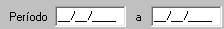

### **Balancete no período:**

####    Filtros:
1.  **Período:** 
    >**Observação:** (Data - *type: Date* -Data da emissão do DAM'S) <br>
    

2.  **Banco:**
    >**Observação:** Seleciona mutipla escolha dos bancos.<br>
    **Exemplo:** *Banco do Brasil, Caixa Econimica, Bradesco e outros bancos.*<br>
    ```
    Banco --> nome 
    ``` 

3. **Classificação pagamento:**
> **Observação:** Select para ordenar por "data_pagamento" ou "data_crédito"

4.  **Situação:**
    >**Observação:** *Select para trazer **DAM'S com situação em** :  abertos, pagos/geral ou pagos/diários.*

```
    input type="radio" 

```
 
####   Layout PDF:
**Campos:** 
 ```
1.  Descrição da Receita / Tributo  -   Descrição da receita ou Sigla;
2.  Arrecadador                     -   Banco;
3.  Natureza                        -   Natureza Juridica; 
3.  Qtd.                            -   Quantidade de DAM's;
4.  Valor Tributo                   -   Valor Original da Cota; 
5.  Desconto (-)                    -   Desconto da Cota;
6.  Multa(+)                        -   Multa da cota;
7.  Juros(+)                        -   Juros da cota;
8.  Correção (+)                    -   Correção monetaria da Cota;
9.  Valor Pago                      -   Valor pago da Cota;
10. Arrecadador Totalizador         -   Todos bancos do relatorio
11. Dia                             -   Data Credito
12. Qtd                             -   Quantidade de Cota cada banco
13. Valor Tributo                   
14. Desconto    
15. Multa
16. Juros 
17. Correção
18. Valor Pago
19. Total de lançamento do dia      - Totalizador dos campos 
20. Total Geral dos Lançamentos     - Total de todos os lançamentos do relatorio, todos os bancos. 
```
