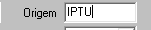

### Carta de Cobrança: 

####    Filtros: 
1.  **Vencidos entre:** 

2.  **Tributo:** 
    >**Observação:** <br>   *Multiplo* _select_ -- classificação de receita (tipo do tributo *IPTU, TFF, ...)*<br>
    <br>
    

3.  **D.A.:** 
    > **Observação:** (*Checkbox*) > Caso seja uma (D.A.) deve-se colocar apenas D.A. do tipo marcado acima em **Tributos**.<br>
    

4.  **Contribuinte:** 
    > **Observação:** Filtro para trazer apenas menor "numero" contribuinte para maior "numero" contribuinte digitado.<br>
    

5.  **Valor cobrança:** 
    > **Observação:** Filtro para trazer apenas valores apartir do menor digitado ao maior digitado.<br>
    **Exemplo:** *Menor numeor R$ 10,00 reais até R$ 1.000,00 reais*.<br>
    

6.  **Imprimir Extrato:** 
    >   **Observação:** *Type Checkbox* ao marcar gera Carta de cobrança com **EXTRATO** com novo _vencimentos_ para os **DAM'S** dos contribuintes.<br>
    

7.  **Calcular:** 
    >   **Observação:** Traz o calculo dos DAM com _Multa, Juros e Correção Monetária_ no extrato. 

8.  **Ordenar:**    
    >   **Observação:** Filtro podendo ordenar por "nome_contribuinte", "logradouro", "bairro" ou "inscrição" 

####   Layout PDF:
**Campos:** 
 ```
1.  Contribuinte    
2.  CPF/CNPJ    
3.  Tipo pessoa
4.  Logradouro
5.  Bairro
6.  N
7.  UF
8.  Municipio
9.  Texto carta de cobrança 
```
