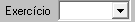
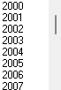

### Relação de DAM's Arrecadados:

####    Filtros:
1.  **Período:**
    >**Observação:** (Data - *type: Date* - Data de pagamento dos DAM'S) <br>
    

2.  **Tributo:**
    >**Observação:** <br>   *Multiplo* _select_ -- classificação de receita (tipo do tributo *IPTU, TFF, ...)*<br>
    <br>
    

3.  **Exercicio:** 
    > **Observação:** Seleciona *Ano (2024, 2023, 2022, ...)* <br>
    Filtro da competencia<br>
    <br>
    

4.  **D.A.:** 
    > **Observação:** *Checkbox* Caso seja uma D.A. deve-se colocar apenas D.A. do tipo do tributo marcado acima em **Tributos**<br>
    

5.  **Parcela:** 
    >**Observação:** *Checkbox* desmarcado,<br>  *Texto ao lado:* _"Exibir Parcelas?"_<br>

6. **Banco:**
    >**Observação:** Seleciona mutipla escolha dos bancos, podendo gerar relação dos DAM's. 

7.  **Inscrição:** 
    >**Observação:** *(Do lançamento do DAM)*, possibilidade de colocar apenas uma inscrição.
    <br> 
    Exemplo abaixo sistema antigo:<br> 
    
    
8.  **Atividade Principal:** 
    >**Observação:** _Multipla opções_, podendo selecionar varios CNAES_PRINCIPAL. <br>

9.  **Faixa de valor:**
    > **Observação:** Filtro de valor_cota, Filtrando do menor valor até maior valor.<br>
    

10. **Classificação pagamento:**
> **Observação:** Select para ordenar por "data_pagamento", "banco" ou "data_crédito"

11. **Ordenar:**
    >**Observação:** Select para ordenar por *(nome_contribuinte, valor_tributo, Numero_DAM's, vencimento DAM'S, Tributo e valor_pago)* apenas uma escolha de organização, 'orde by'. 

####   Layout PDF:
**Campos:** 
 ```
1.  Contribuinte - Nome do Contribuinte e CPF/CNPJ;
2.  N. Documento - Numero do DAM;
3.  Tributo      - Sigla do Tributo  (Trazendo D.A. caso seja uma D.A ou Parc de parcelamento );
4.  Vencimento   - Vencimento original;
5.  Parc.        - Caso tenha parcela, trazer quantidade, *exemplo:*"1/10" ou Unica.
6.  Valor        - Valor da cota original 
7.  Desconto(-)    - Valor desconto da cota; 
8.  Multa (+), juros (+) e correção (+)  - Campos valor de Juros, multa e correção da Cota;
9.  Valor Pago   - Valor pago da cota;
10. Dt. pagamento- Data do pagamento da cota; 
```

