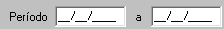
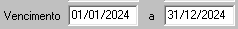
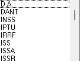
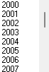
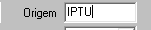

### Documentos Pré-inscrito/ Excluido
#### Filtro:

1.  **Período:** 
    >**Observação:** (Data - *type: Date* -Data da emissão do DAM'S)  
    

2.  **Vencimento:**
    >**Observação:** (Data - *Type: Date* - Data de vencimento original dos DAM's) 
    )

3.  **Tributo:** 
    >**Observação:**     *Multiplo* _select_ -- classificação de receita (tipo do tributo *IPTU, TFF, ...)* 
     
    

4.  **Exercicio:** 
    > **Observação:** Seleciona *Ano (2024, 2023, 2022, ...)*  
    Filtro da competencia 
     
    

5.  **D.A.:** 
    > **Observação:** *Checkbox* Caso seja uma D.A. deve-se colocar apenas D.A. do tipo do tributo marcado acima em **Tributos** 
    

6.  **Motivo:**
    >   **Observação:** Multiplo _Select_, podendo selecionar varios **motivos:** Excluido, pré-inscrito, cancelado, impugnado, extinção, migração, suspenso e compensado.    

7.  **Atividade Principal:** 
    >**Observação:** _Multipla opções_, podendo selecionar varios CNAES_PRINCIPAL.  

