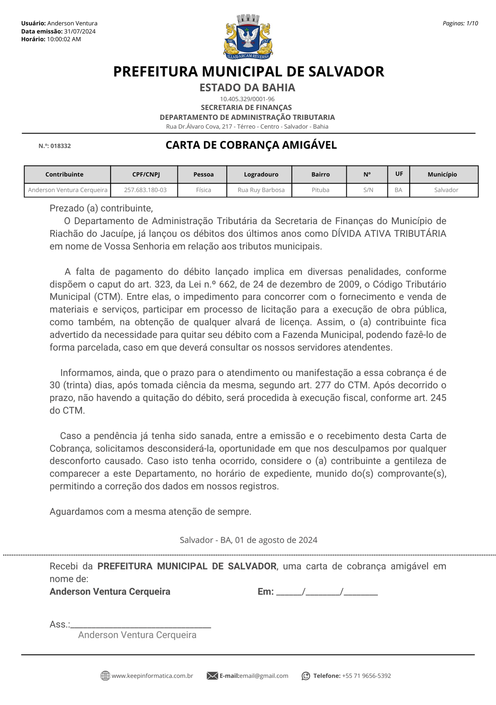

#   Tributos Web 
##  Relatorios Descrição Filtros 


### Relação de Documentos Emitidos:
```
Filtros:
```
1.  Período 
   
    >**Observação:** (Data - *type: Date* -Data da emissão do DAM'S) <br>
    

2.  Tributo 
    >**Observação:** <br>   *Multiplo* _select_ -- classificação de receita (tipo do tributo *IPTU, TFF, ...)*<br>
    <br>
    


3.  Exercicio 
    > **Observação:** Seleciona *Ano (2024, 2023, 2022, ...)* <br>
    Filtro da competencia<br>
    <br>
    

4.  D.A. 
    > **Observação:** *Checkbox* Caso seja uma D.A. deve-se colocar apenas D.A. do tipo do tributo marcado acima em **Tributos**<br>
    

5.  Parcela 
    >**Observação:** *Checkbox* desmarcado,<br>  *Texto ao lado:* _"Exibir Parcelas?"_<br>

6.  Inscrição 
    >**Observação:** *(Do lançamento do DAM)*, possibilidade de colocar apenas uma inscrição.
    <br> 
    Exemplo abaixo sistema antigo:<br> 
    
    
7.  Atividade Principal 
    >**Observação:** _Multipla opções_, podendo selecionar varios CNAES_PRINCIPAL. <br>
    

8.  Situação 
    >**Observação:** _Multiplo select_, Filtrando as situação dos DAM's <br>
    *(Sem filtro[Todos], Pagos, aberto e vencidos)*
        1. Podendo Filtrar: Pagos + Aberto ou Abertos + vencidos

9.  Faixa de valor:
    > **Observação:** Filtro de valor_cota, Filtrando do menor valor até maior valor.<br>
    

10. Ordenar 
> **Observação:** Select para ordenar por (numero do DAM, contribuinte ou vencimento do DAM'S) apenas uma escolha de organização, 'orde by'.   


### Listagem de Inadiplencia:
```
Filtros:
```
1.  Período 
   
    >**Observação:** (Data - *type: Date* - Data de vencimento do DAM'S) <br>
    

2.  Tributo 
    >**Observação:** <br>   *Multiplo* _select_ -- classificação de receita (tipo do tributo *IPTU, TFF, ...)*<br>
    <br>
    

3.  Exercicio 
    > **Observação:** Seleciona *Ano (2024, 2023, 2022, ...)* <br>
    Filtro da competencia<br>
    <br>
    

4.  D.A.  
    > **Observação:** *Checkbox* Caso seja uma D.A. deve-se colocar apenas D.A. do tipo do tributo marcado acima em **Tributos**<br>
    

5.  Parcela 
    >**Observação:** *Checkbox* desmarcado,<br>  *Texto ao lado:* _"Exibir Parcelas?"_<br>

6.  Inscrição 
    >**Observação:** *(Do lançamento do DAM)*, possibilidade de colocar apenas uma inscrição.
    <br> 
    Exemplo abaixo sistema antigo:<br> 
    
    
7.  Atividade Principal 
    >**Observação:** _Multipla opções_, podendo selecionar varios CNAES_PRINCIPAL. <br>

8.  Faixa de valor:
    > **Observação:** Filtro de valor_cota, Filtrando do menor valor até maior valor.<br>
    

9. Ordenar 
> **Observação:** Select para ordenar por (nome_contribuinte, DAM'S ou inscrição) apenas uma escolha de organização, 'orde by'.   


### Relação de DAM's Arrecadados:
####    Filtros:
1.  **Período:**
    >**Observação:** (Data - *type: Date* - Data de pagamento dos DAM'S) <br>
    

2.  **Tributo:**
    >**Observação:** <br>   *Multiplo* _select_ -- classificação de receita (tipo do tributo *IPTU, TFF, ...)*<br>
    <br>
    

3.  **Exercicio:** 
    > **Observação:** Seleciona *Ano (2024, 2023, 2022, ...)* <br>
    Filtro da competencia<br>
    <br>
    

4.  **D.A.:** 
    > **Observação:** *Checkbox* Caso seja uma D.A. deve-se colocar apenas D.A. do tipo do tributo marcado acima em **Tributos**<br>
    

5.  **Parcela:** 
    >**Observação:** *Checkbox* desmarcado,<br>  *Texto ao lado:* _"Exibir Parcelas?"_<br>

6. **Banco:**
    >**Observação:** Seleciona mutipla escolha dos bancos, podendo gerar relação dos DAM's. 

7.  **Inscrição:** 
    >**Observação:** *(Do lançamento do DAM)*, possibilidade de colocar apenas uma inscrição.
    <br> 
    Exemplo abaixo sistema antigo:<br> 
    
    
8.  **Atividade Principal:** 
    >**Observação:** _Multipla opções_, podendo selecionar varios CNAES_PRINCIPAL. <br>

9.  **Faixa de valor:**
    > **Observação:** Filtro de valor_cota, Filtrando do menor valor até maior valor.<br>
    

10. **Classificação pagamento:**
> **Observação:** Select para ordenar por "data_pagamento", "banco" ou "data_crédito"

11. **Ordenar:**
    >**Observação:** Select para ordenar por *(nome_contribuinte, valor_tributo, Numero_DAM's, vencimento DAM'S, Tributo e valor_pago)* apenas uma escolha de organização, 'orde by'.   


### **Balancete no período:**
####    Filtros:
1.  **Período:** 
    >**Observação:** (Data - *type: Date* -Data da emissão do DAM'S) <br>
    

2.  **Banco:**
    >**Observação:** Seleciona mutipla escolha dos bancos.<br>
    **Exemplo:** *Banco do Brasil, Caixa Econimica, Bradesco e outros bancos.*<br>
    ```
    Banco --> nome 
    ``` 
       

3. **Classificação pagamento:**
> **Observação:** Select para ordenar por "data_pagamento" ou "data_crédito"

4.  **Situação:**
    >**Observação:** *Select para trazer **DAM'S com situação em** :  abertos, pagos/geral ou pagos/diários.*
    <br>
    ```
    <input type="radio">  
    ``` 


### Carta de Cobrança: 
####    Filtros: 
1.  **Vencidos entre:** 

2.  **Tributo:** 
    >**Observação:** <br>   *Multiplo* _select_ -- classificação de receita (tipo do tributo *IPTU, TFF, ...)*<br>
    <br>
    

3.  **D.A.:** 
    > **Observação:** (*Checkbox*) > Caso seja uma (D.A.) deve-se colocar apenas D.A. do tipo marcado acima em **Tributos**.<br>
    

4.  **Contribuinte:** 
    > **Observação:** Filtro para trazer apenas menor "numero" contribuinte para maior "numero" contribuinte digitado.<br>
    

5.  **Valor cobrança:** 
    > **Observação:** Filtro para trazer apenas valores apartir do menor digitado ao maior digitado.<br>
    **Exemplo:** *Menor numeor R$ 10,00 reais até R$ 1.000,00 reais*.<br>
    

6.  **Imprimir Extrato:** 
    >   **Observação:** *Checkbox* ao marcar gera Carta de cobrança com extrato com novo _vencimento_ para os **DAM'S** dos contribuintes. 
    