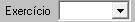

#   Tributos Web 
##  Relatorios Descrição Filtros 

### Carta de Cobrança: 
####    Filtros: 
1.  **Vencidos entre:** 

2.  **Tributo:** 
    >**Observação:**     *Multiplo* _select_ -- classificação de receita (tipo do tributo *IPTU, TFF, ...)* 
     
    

3.  **D.A.:** 
    > **Observação:** (*Checkbox*) > Caso seja uma (D.A.) deve-se colocar apenas D.A. do tipo marcado acima em **Tributos**. 
    

4.  **Contribuinte:** 
    > **Observação:** Filtro para trazer apenas menor "numero" contribuinte para maior "numero" contribuinte digitado. 
    

5.  **Valor cobrança:** 
    > **Observação:** Filtro para trazer apenas valores apartir do menor digitado ao maior digitado. 
    **Exemplo:** *Menor numeor R$ 10,00 reais até R$ 1.000,00 reais*. 
    

6.  **Imprimir Extrato:** 
    >   **Observação:** *Type Checkbox* ao marcar gera Carta de cobrança com **EXTRATO** com novo _vencimentos_ para os **DAM'S** dos contribuintes. 
    

7.  **Calcular:** 
    >   **Observação:** Traz o calculo dos DAM com _Multa, Juros e Correção Monetária_ no extrato. 

8.  **Ordenar:**    
    >   **Observação:** Filtro podendo ordenar por "nome_contribuinte", "logradouro", "bairro" ou "inscrição" 

### Contribuinte Adimplente
#### Filtros

1.  Período 
   
    >**Observação:** (Data - *type: Date* -Data da emissão do DAM'S)  
    

2.  Tributo 
    >**Observação:**     *Multiplo* _select_ -- classificação de receita (tipo do tributo *IPTU, TFF, ...)* 
     
    

3.  Exercicio 
    > **Observação:** Seleciona *Ano (2024, 2023, 2022, ...)*  
    Filtro da competencia 
     
    

### Relação de Notas Fiscais Avulsas:
####    Filtros:

1.  **Período:** 
    >**Observação:** (Data - *type: Date* -Data da emissão do DAM'S)  
    

2.  **Prestador:**
    >   **Observação:** Filtro de pesquisa dos prestadores de serviço, trazendo as informações apenas do prestador desejado com filtro.
    

3.  **Tomador:** 
    >   **Observação:**     Fiiltro de pesquisa dos tomadores de serviço, trazendo as informações apenas do tomador desejado com filtro. 
    

4. **Ordenar:**
    >   **Observação:** Select para ordenar por (Data emissão da Nota Fiscal Avulsa, numero da Nota Fiscal ou prestador alfabetica [A-Z]), apenas uma escolha de organização, 'orde by'.

### Documentos Pré-inscrito/ Excluido
#### Filtro:

1.  **Período:** 
    >**Observação:** (Data - *type: Date* -Data da emissão do DAM'S)  
    

2.  **Vencimento:**
    >**Observação:** (Data - *Type: Date* - Data de vencimento original dos DAM's) 
    

3.  **Tributo:** 
    >**Observação:**     *Multiplo* _select_ -- classificação de receita (tipo do tributo *IPTU, TFF, ...)* 
     
    

4.  **Exercicio:** 
    > **Observação:** Seleciona *Ano (2024, 2023, 2022, ...)*  
    Filtro da competencia 
     
    

5.  **D.A.:** 
    > **Observação:** *Checkbox* Caso seja uma D.A. deve-se colocar apenas D.A. do tipo do tributo marcado acima em **Tributos** 
    

6.  **Motivo:**
    >   **Observação:** Multiplo _Select_, podendo selecionar varios **motivos:** Excluido, pré-inscrito, cancelado, impugnado, extinção, migração, suspenso e compensado.    

7.  **Atividade Principal:** 
    >**Observação:** _Multipla opções_, podendo selecionar varios CNAES_PRINCIPAL.  

